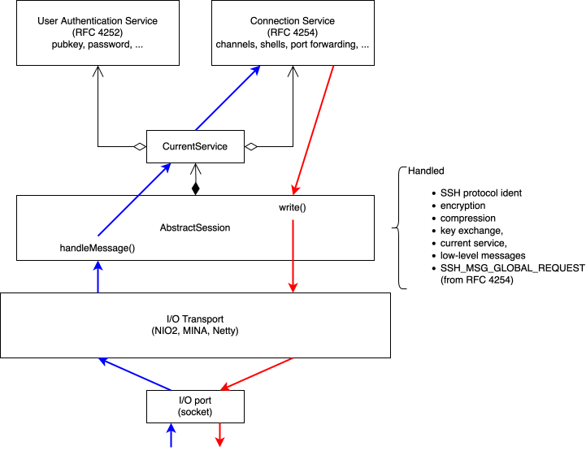
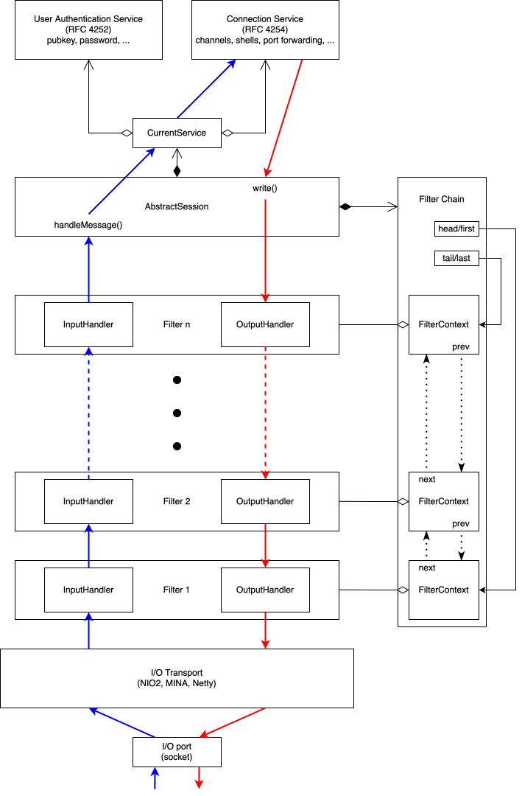
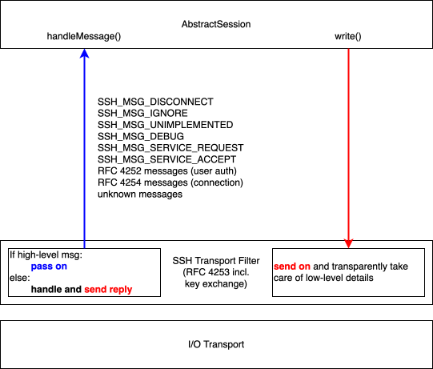

# Session Anatomy

Let's take a closer look at the anatomy of an SSH session in Apache MINA sshd.

The main class implementing an SSH session is `AbstractSession`. Specifics of client and server
sessions are then implemented in subclasses `ClientSessionImpl` or `ServerSessionImpl`, respectively.

Basically an `AbstractSession` receives SSH messages and dispatches them to the currently active
SSH service. There is always exactly one such service active. During the lifetime of an SSH
session, there are normally two such services:

- first a user authentication service (`UserAuthService`) handling user log-in, and
- after successful log-in, a connection service handling SSH channels.

## Legacy: Apache MINA sshd version 2

In the 2.x.y versions of Apache MINA sshd, this looked roughly like this:

As one can see `AbstractSession` was responsible for a lot of things: all the various aspects of
SSH connections were handled in this one big messy class. An incoming message would be passed
from the I/O transport directly to the session; where it would be decrypted, decompressed, and
then handled. Outgoing messages (from either user authentication, or from the connection service,
or also messages sent directly by the `AbstractSession` itself) would all go through
`AbstractSession.write()`, and the session would compress and encrypt them before handing
them off to the I/O transport for sending over the socket.

The session also dealt with all the intricacies of performing key exchanges. All this got more
and more convoluted and brittle over time and became a nightmare to maintain or reason about.
It also got very hard to improve or extend. Implementing a control master/client configuration
like OpenSSH would have been very difficult or even impossible because the SSH transport and
channel protocols were not cleanly separated, or implementing client-side proxy support would
have been possible only with additional hacks.

## Version 3: The Filter Chain
In version 3 of Apache MINA sshd, we've taken this apart. We've given each session a *filter chain*.
This filter chain results then in the following structure:

You may know the concept of a filter chain from web servers, or also from  I/O libraries like
Apache MINA or Netty (where it's called a "pipeline").

Each filter has a handler for incoming messages and one for outgoing messages. A filter that shall
apply to messages in only one direction may also have only one handler, for instance, only a handler
for incoming messages but none for outgoing ones. If a filter doesn't have a handler for a direction,
it is simply skipped for those messages.

Each SSH `Session` in Apache MINA sshd has such a filter chain.

You may notice that individual filters do not "know" the other filters: there are no links from one
filter directly to the  next or previous one in the chain. Instead, the filter chain manages the
order of the filters itself via a doubly-linked list of `FilterContext`s. When a filter wants to pass
on an incoming message to the next filter, or an outgoing message to the previous filter, it always
goes through its `FilterContext`:

The link between a `Filter` and its `FilterContext` is bi-directional: the filter knows its context as
the `owner()`, while a context knows its `filter`. This cleanly separates managing the order of filters
from the filters itself, and incidentally it also simplifies the APIs.

Note that the whole implementation of this filter chain or the number of method calls needed to pass
messages along the filter chain is not relevant for performance in SSH at all. The main factors
influencing  performance are encryption for the transport, and the cryptographic operations in key
exchange for connection initialization.

## SSH Transport as a Filter Chain

With a filter chain in place, we use it to split up the SSH transport defined in
[RFC 4253](https://datatracker.ietf.org/doc/html/rfc4253) into separate filters. We thus have a filter
chain implementing SSH transport: nearly all of the convoluted code from the version 2 `AbstractSession`
can be removed and be placed in individual filters.

We get a clear separation of concerns, and we can even handle certain aspects completely transparently
for upper layers. For instance, the `IdentFilter` at the bottom of the filter chain can automatically
handle sending and receiving the SSH protocol version string. Other filters later ("higher") in the
chain don't have to care about this at all. Likewise the KexFilter can manage the whole key exchange
sub-protocol transparently such that the `AbstractSession` doesn't have to deal with it at all.

This separation also has a huge maintenance benefit: because each filter deals with only one isolated
aspect of the SSH transport, it can also be tested easily in isolation without having to mock umpteen
unrelated functions.

Note that the `InjectIgnoreFilter` has no input handler: it will be skipped for incoming messages. For
outgoing messages, it may insert spurious `SSH_MSG_IGNORE` messages of random length random data into
the message stream. This is the "additional protection against advanced traffic analysis techniques"
mentioned in [RFC 4253](https://datatracker.ietf.org/doc/html/rfc4253#section-11.2).

### Concurrency

The SSH protocol is basically non-concurrent. There are various places in the RFCs that require handling
messages in sequence. SSH packages must be decrypted or encrypted in the order they are received or sent.
Key exchange is basically a synchronous sub-protocol; while a key exchange is on-going, any higher-level
messages (from the user authentication or connection service) are blocked and are sent only once the key
exchange is over.

The input and output filter handler chains are not synchronized between each other. Sending and receiving
messages can occur concurrently. The exception to this is the `KexFilter`: if a key exchange is initiated
by the peer (an SSH_MSG_KEXINIT message is received), it must synchronize with the output side to ensure
that the output side starts blocking and buffering high-level messages until the key exchange is over.

### Encapsulating the SSH Transport

To simplify using the filters for the SSH transport, we've introduced a single `SshTransportFilter`. This
is a single filter encapsulating the filter chain as shown above.

This simplifies the session's filter chain to have single filter that itself contains a nested filter chain
with the individual filters, which simplifies the setup of an `AbstractSession` even more.

## Customizing the Filter Chain

The filter chain also makes it easy to customize the transport to account for special circumstances. For
instance, user code could insert its own filter below the SSH transport filter to deal with special setups
needed for the communication. An example would be handling proxies. Setting up a tunnel through a SOCKS or
HTTP CONNECT proxy could be implemented as its own filter that transparently handles the proxy protocol,
including proxy authentication, and then this filter can be added to the filter chain:

This can be done also on the server side, for instance with a proxy filter handling the HAproxy protocol
header. In fact, there is such a filter available in bundle `sshd-contrib`; it's called `HAProxyProtocolFilter`.

### How to add Custom Filters

User code can customize the filter chain of an `AbstractSession` via a `SessionListener`. There are two event
callbacks that can be used to modify the filter chain:

* `sessionCreated`: at this point the filter chain is still empty (it contains no filters). User code can
completely override the default filter chain by adding filters here. If the filter chain contains any filter
after this event, the framework will assume the filter chain is fully set up and will not add its default
filters.
* `sessionStarting`: at this slightly later point, the filter chain is set up, either with the default setup,
or with a customized setup done in `sessionCreated`. User code can now modify the filter chain, for instance
by adding additional filters to the default chain.

After that, the `AbstractSession` will always add two internal filters: one at the very bottom to connect
the filter chain with the I/O transport, and one at the very top to connect the message dispatching in
`AbstractSession` with the filter chain.

## Starting an SSH Session

Once an SSH session is started (automatically by the framework after the `sessionStarting` event), the filter
chain should not be modified anymore. Adding filters to or removing filters from the chain while messages
are coming in or going out would be very tricky to get right without race conditions.

If there are filters that should not be active after some time, they can set their incoming or outgoing
handlers to `null` (use an `AtomicReference`).- An example would be the aforementioned proxy filter: once the
proxy tunnel is established (or the HAproxy protocol header has been received), such a proxy filter will
not do anything anymore but pass on messages. Such a filter can then set its handlers to `null`. The filter
chain will skip any filter that has a `null` handler for the direction a particular message is going.

If your filter does this (sets a handler to `null`), it must still be prepared to forward messages. Due to
concurrency, it's possible that a message coming from the next or previous filter in the chain still got a
reference to the handler just before it was set to `null`, and if that happens, such a message must still
be forwarded.

### Internals

A session is started by the framework simply by telling the SSH transport filter to start a key exchange.
The `KexFilter` will send an initial `SSH_MSG_KEXINIT` message. It will also block any further message from
"above" until this initial key exchange is over.

This initial `SSH_MSG_KEXINIT` message will percolate down the filter chain:
* As it is a KEX message, no `SSH_MSG_IGNORE` will be injected.
* Compression will be off initially, so the message is just forwarded.
* There will be no encryption initially, so the message is just forwarded.
* The `IdentFilter` will see that this is the very first message and will first send the SSH protocol version
string, and then the `SSH_MSG_KEXINIT` message afterwards.

This process is identical on the client and on the server side.

On the client side, Apache MINA sshd supports two settings that make the client wait until it has gotten the
server's messages:
* `CoreModuleProperties.SEND_IMMEDIATE_IDENTIFICATION`: by default `true`. If `false`, the client sends its SSH
protocol version only after it has received the server's. This is implemented transparently in `IdentFilter`.
* `CoreModuleProperties.SEND_IMMEDIATE_KEXINIT`: by default `true`. If `false`, the client sends its `SSH_MSG_KEXINIT`
only after it has received the server's. This is handled in a special `DelayKexFilter` that sits below the
`KexFilter` and that is omitted on purpose from the above diagrams since it is a really special special case
and including it would only have confused the presentation.

These two options were introduced long ago to handle connecting to old SSH servers. In SSH version 1, the
server sent its protocol version string first, and the client always came second. In SSH version 2, the
protocol is symmetric, and both sides just send their two initial messages, and then the initial key exchange
takes off. Compare issue [SSHD-930](https://issues.apache.org/jira/browse/SSHD-930) for Apache MINA sshd,
and [OpenSSH issue 1999](https://bugzilla.mindrot.org/show_bug.cgi?id=1999) for OpenSSH 6.2 (from 2012!).
Note that Apache MINA sshd implements only SSH version 2; SSH version 1 is not supported.

