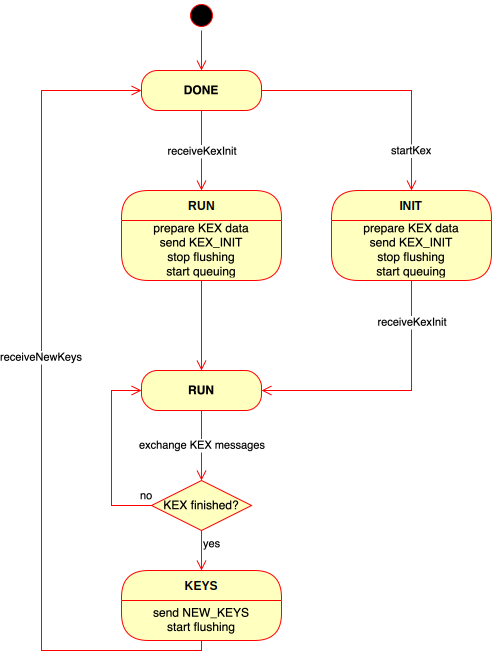
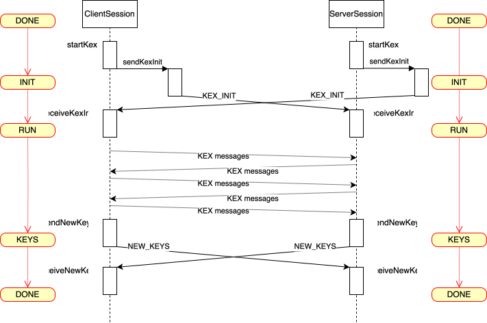

## SSH Key Exchange

**Key Exchange** (or **KEX** for short) is a sub-protocol in the SSH protocol
enabling the two parties in a connection to exchange information and compute a
shared secret that will then be used for encrypting all following messages.

A key exchange runs initially, after the network connection is established,
but before authentication. Later on, KEX may be repeated; when exactly,
depends on various settings:

* it is re-run when a certain amount of bytes have been sent since the last KEX.
* it may be re-run when a certain number of SSH packets have been sent since the last KEX.
* it may be re-run when a certain time has elapsed since the last KEX.

The purpose of re-running KEX is to establish a new shared secret from time to
time, changing the encryption for all subsequent messages, until the next KEX.
This mitigates possible attacks against the encryption when a lot of data is sent
using the same encryption with the same shared secret.

KEX is specified in [RFC 4253, section 7](https://tools.ietf.org/html/rfc4253#section-7).

### Basic KEX message exchange

A key exchange starts with both parties sending a SSH_MSG_KEX_INIT message,
passing along information about available cryptographic algorithms. Both
parties can decide from this information what kind of key exchange to perform.
They then run the cryptographic key exchange protocol, which may incur several
message exchanges. Once that protocol ends, both sides know the shared secret.
At that point they both send a SSH_MSG_NEW_KEYS message to tell the other side
they're ready, and use the new encryption for any subsequent outgoing message.
The SSH_MSG_NEW_KEYS message itself is still sent with the old encryption. On
receiving a SSH_MSG_NEW_KEYS message, each side starts using the new encryption
to decrypt any subsequent incoming messages. Note that the SSH_MSG_NEW_KEYS
message does not contain the new encryption key or the shared secret; it is
just a marker message telling the other side that from now on, the new encryption
will be used.

Key exchange is implemented in the `KexFilter` in the filter chain of an `AbstractSession`.
It maintains a *KEX state* (in Java [`KexState`](../../sshd-common/src/main/java/org/apache/sshd/common/kex/KexState.java)), which models the key exchange on one side of the connection as
a state machine going through the states `DONE`, `INIT`, `RUN`, `KEYS`, `DONE`.

These states mark important points in the key exchange sub-protocol:

* `DONE` means no key exchange is ongoing, this side has received the peer's SSH_MSG_NEW_KEYS message, and both sides have a shared secret that they use for encryption.
* `INIT` means this side of the connection has requested a new KEX; it has sent it's SSH_MSG_KEX_INIT message.
* `RUN` means this side has received the peer's SSH_MSG_KEX_INIT message, and key exchange is running now to determine a new shared secret.
* `KEYS` means the key exchange has been done; both sides know the shared secret, and this side has sent its SSH_MS_NEW_KEYS message.
* When the peer's SSH_MSG_NEW_KEYS message is received, the state changes back to `DONE`.

In Apache MINA sshd, there are methods in `KexFilter` for each of the KEX
messages:

* `startKex`: switches from `DONE` to `INIT` and calls `sendKexInit` to send the SSH_MSG_KEX_INIT message.
* `receiveKexInit`: receives the peer's SSH_MSG_KEX_INIT message; switches to `RUN`.
* `sendNewKeys`: switches from `RUN` to `KEYS` and sends this side's SSH_MS_NEW_KEYS message.
* `receiveNewKeys`: receives the peer's SSH_MSG_KEX_INIT message; switches from `KEYS` to `DONE`.

Because both sides may request a new key exchange at any time, it's also possible
that they both do so simultaneously, and their initial SSH_MSG_KEX_INIT messages
cross:

The protocol is symmetric, so "client" and "server" could also be inverted.

### Message sending

KEX can run *at any time* during an SSH connection. Either side can request a new
key exchange anytime. While a key exchange is ongoing, some messages must *not*
be sent.

But after having sent its own SSH_MSG_KEX_INIT message, each side must still handle
incoming non-KEX messages until it receives the peer's SSH_MSG_KEX_INIT message.

How does Apache MINA sshd avoid sending non-KEX messages while a KEX is ongoing?
There may be application threads pumping out data, or one may receive, after having
sent one's own SSH_MSG_KEX_INIT message non-KEX messages that might require sending
back an answer.

The KexFilter's outgoing messages handler `KexOutputHandler` looks at the current KEX
state and at the packet that is to be sent and decides what to do with it:

* If no KEX is ongoing, or if the packet is a low-level packet allowed during KEX,
it is allowed through and passed on to the next lower filter in the filter chain.
* Otherwise, the packet is queued.

Once KEX is done, the queue is flushed, i.e., all the queued packets are encrypted
(with the new encryption) and sent.

This mechanism has one drawback: if there are data pumping threads sending data
through a channel (and there is a large channel window), arbitrarily many packets
may be queued, and sending them may itself trigger another key exchange. If the
queue is flushed synchronously from `receiveNewKeys` (or from `sendNewKeys`), this
side will not be able to react to a new key exchange request from the peer. (Or
to a disconnection message.) Therefore the queue is flushed *asynchronously*.

To avoid that application threads create a huge queue, Apache MINA sshd prevents
threads from sending SSH_MSG_CHANNEL_DATA or SSH_MSG_CHANNEL_EXTEDED_DATA packets
during KEX by closing all channel `RemoteWindows` by setting their size to zero.
Only once the key exchange is over are these remote windows restored, and the
threads can write data again.

The queue thus should never contain many packets; at most one per open channel. 

Flushing the queue and enqueuing new packets is a classic producer-consumer problem,
but there is a twist: because of the current architecture of the framework, the queue
cannot be bounded, and producers should not block. But there is only a single consumer:
the flushing thread.

The implementation contains a number of measures that should ensure that the flushing
thread is not overrun by producers and actually can finish.

1. Application threads are prevented from continuously sending packets during KEX because the channel windows are closed; see above.
2. The flushing thread (the consumer) gets priority over the producers.
3. The flushing thread flushes a number of packets (a chunk) at a time. It starts off with a chunk size of two. If it detects on the next chunk of packets to write that more packets were enqueued than were written in the last chunk, the chunk size is increased.
4. While a chunk is written, new enqueue attempts wait.
5. It should be rare that more than one new packet gets enqueued in between chunks, because of (2).

Again, "client" and "server" could also be inverted. For instance, a client uploading
files via SFTP might have an application thread pumping data through a channel, which
might be blocked during KEX.

### Strict Key Exchange

"Strict KEX" is an SSH protocol extension introduced in 2023 to harden the protocol against
a particular form of attack. For details, see ["Terrapin attack"](https://www.terrapin-attack.com/)
and [CVE-2023-48795](https://nvd.nist.gov/vuln/detail/CVE-2023-48795). The "strict KEX"
counter-measures are active if both peers indicate support for it at the start of the initial
key exchange. By default, Apache MINA sshd always supports "strict kex" and advertises it, and
thus it will always be active if the other party also supports it.

