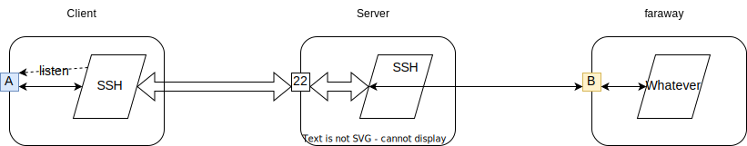
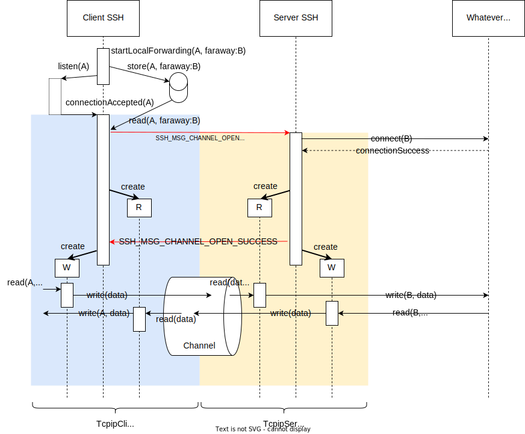
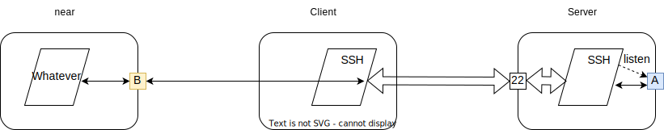
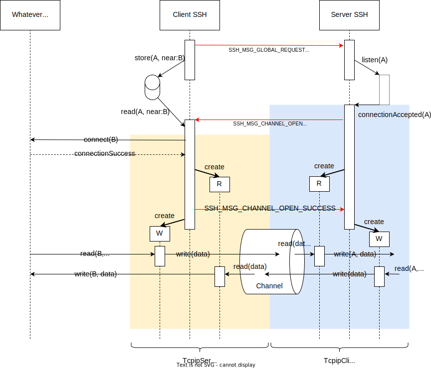
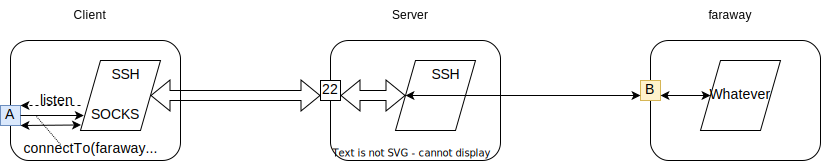
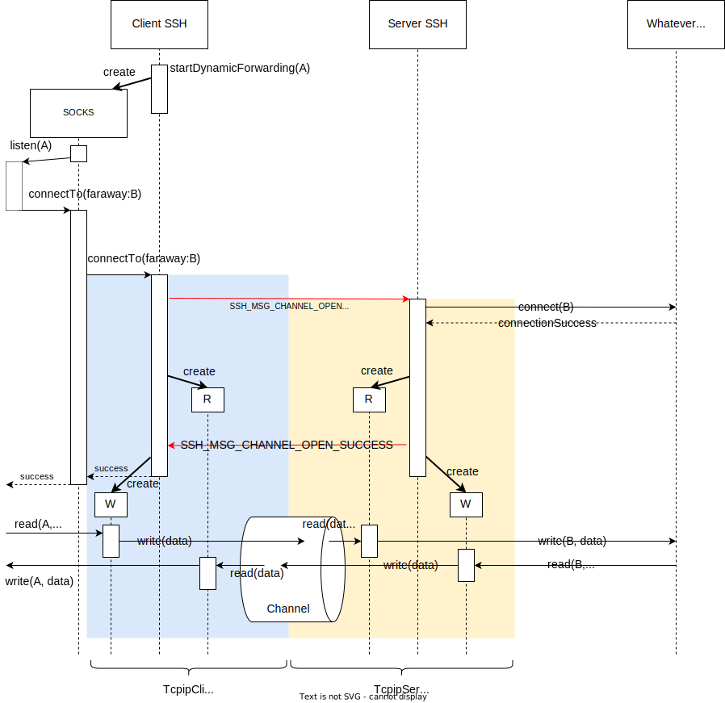

## TCP/IP Port Forwarding

**TCP/IP port forwarding** (also known as **tunneling**) is a functionality of SSH
to proxy a TCP/IP connection through an encrypted SSH channel.

SSH provides three different TCP/IP forwarding modes:

* *Local port forwarding* to forward connections coming to a port on the client host through SSH to an SSH server, and there to some port on a host reachable from the SSH server.
* *Remote port forwarding* to make an SSH server forward connections coming to a port on the server back to the client, and there to some port on a host reachable from the client.
* *Dynamic port forwarding* is a variation of local port forwarding: the SSH client starts a SOCKS proxy listening on the local port, and initiates a local port forwarding whenever that SOCKS proxy gets a request to connect to some port on some remote host reachable from the SSH server.

TCP/IP port forwarding is specified in [RFC 4254](https://tools.ietf.org/html/rfc4254#section-7).

### Local Port Forwarding

Local port forwarding can be set up with OpenSSH with the `-L` command-line option
on the client:

```
ssh -L A:faraway:B server
```

This results in the client SSH process listening on port A for incoming connections.
When a connection arrives, the client SSH process opens an SSH channel to the server,
and tells the server to connect to port B on host "faraway". If the SSH server can
make that connection to "faraway", it confirms the channel creation.



The SSH client then starts reading data from port A and sends it encrypted through
the channel. Any data arriving on the channel from the SSH server is decrypted and
written to port A. The server decrypts any data arriving on its end of the SSH
channel and writes it to port B on host "faraway", and starts reading data from
that port and sends it encrypted through the channel to the SSH client.

Note that "faraway" is resolved on the SSH server. If "faraway" is "localhost",
this means that port B is on the SSH server itself.

The following interaction diagram illustrates the process of setting up a local
port forward in a little more detail:



In Apache MINA sshd, the part of this interaction running on the SSH client
(listening on the local port, and requesting the channel to be opened; highlighted
with a blue background) is implemented in [`TcpipClientChannel`](../../sshd-core/src/main/java/org/apache/sshd/common/forward/TcpipClientChannel.java)
and in [`DefaultForwarder`](../../sshd-core/src/main/java/org/apache/sshd/common/forward/DefaultForwarder.java).
The part running on the server (connecting to port B on host "faraway", confirming
the channel creation; highlighted with a yellow background) is implemented in
[`TcpipServerChannel`](../../sshd-core/src/main/java/org/apache/sshd/server/forward/TcpipServerChannel.java).

(The diagram shows the message forwarding from/to the ports through the channel
via two threads on each side; an "R" thread reading from the channel and writing
to the port, and a "W" thread reading from the port and writing to the channel.
The actual implementation is a little different and uses asynchronous I/O for
both.)

### Remote Port Forwarding

Remote port forwarding can be set up with OpenSSH with the `-R` command-line option
on the client:

```
ssh -R A:near:B server
```

This makes the *SSH server* listen on a local port on the server for incoming
connections. When a connection arrives, the server SSH process opens an SSH channel
to the *client*. The client connects to port B on host "near", and if that connection
is successful, it confirms the channel creation.



Note that "near" is resolved on the client. If "near" is "localhost", port B will
be on the SSH client host.

Remote port forwarding is basically the inverse of local port forwarding. Basically
the only difference is that the client first has to send a message to the SSH server
telling it to play the "client" role in this forwarding:



Note how similar this diagram is to the interactions shown for local port forwarding
above. Much of it is just a mirror image, and this symmetry also shows in the code:
the SSH server part of Apache MINA sshd uses a `TcpipClientChannel` for the server-side
part, while the client code uses a `TcpipServerChannel`.

Some details specified in RFC 4254 have been omitted from this diagram. For instance,
the client will accept the "forwarded-tcpip A" request only if it had previously indeed
requested a remote forwarding for that port (the initial "tcpip-forward A" global
request). A client can also cancel a previously made "tcpip-forward" request.

### Dynamic Port Forwarding

Dynamic port forwarding can be set up with OpenSSH with the `-D` command-line option
on the client:

```
ssh -D A server
```

This makes the SSH client start a SOCKS proxy listening on port A. Whenever this SOCKS
proxy gets a request to connect to a port B on a host "faraway" (reachable from the SSH
server), it sets up a local port forward.



The interactions for setting up the forwarding are the same as in local port forwarding,
but at the beginning the SOCKS protocol runs to establish where to connect to.



### Buffering

The tunnel has on each end two handlers:

* A "read" handler (marked "R" in the interaction diagrams) that reads from the SSH connection between the SSH client and the SSH server, and that writes any data read to a port.
* A "write" handler (marked "W" in the interaction diagrams) that reads from a port and writes to the SSH connection between the SSH client and the SSH server.

There is *no* buffering in either handler. Each reads a fixed-size buffer, and then
writes out that buffer. Only once that single buffer has been written the handler
initiates the next read. This keeps memory usage constant in the handlers; there is
only a single read buffer that needs to get read and written.

It also automatically throttles the throughput to the slowest part of the connection.
If data is being produced at port A faster than it can be written to the channel, data
doesn't pile up in some buffer chain inside the SSH client or server's "write" handler.
Instead we "push back" on the producer by not reading faster than we can write. At
some point, the lower-level transport buffers will be full, and the producer will wait
with sending more data until SSH has forwarded the previously produced data.

The size of the read buffers can influence the performance of the forwarding. SSH
transfers data in packets, which have a certain maximum size (which in turn is limited
by the network packet size of the underlying TCP/IP transport). Best results can be
expected if these buffer sizes match, or if the read buffers for the ports are a
multiple of the SSH packet payload size. If the read buffer is larger than the SSH
packet payload size, writing it to the SSH channel will break it up into several
SSH packets, and the next read on the port will occur only when all packets have been
written.

Note that the SSH channel is subject to the normal channel windowing mechanism defined
in RFC 4254. If the sending window (the "remote window") is exhausted, the sender needs
to wait until the receiver increases the window size again. (I.e., until it has received
an SSH_MSG_CHANNEL_WINDOW_ADJUST message from the receiving side.)
